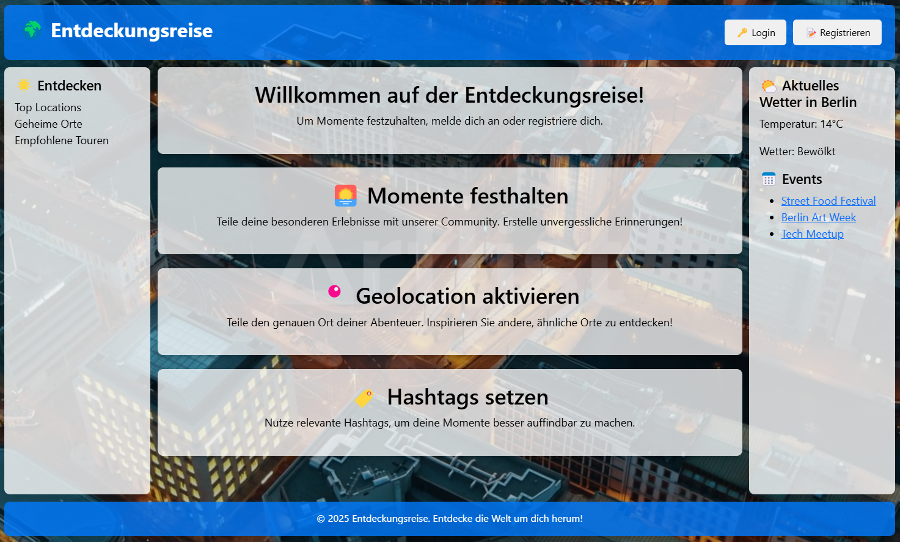
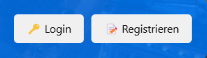
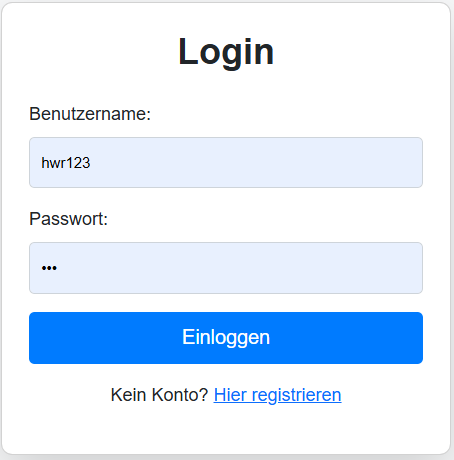
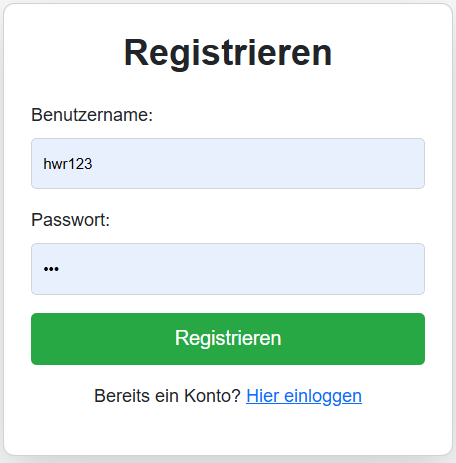
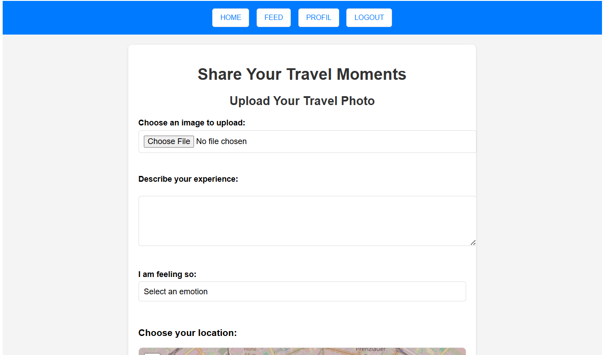
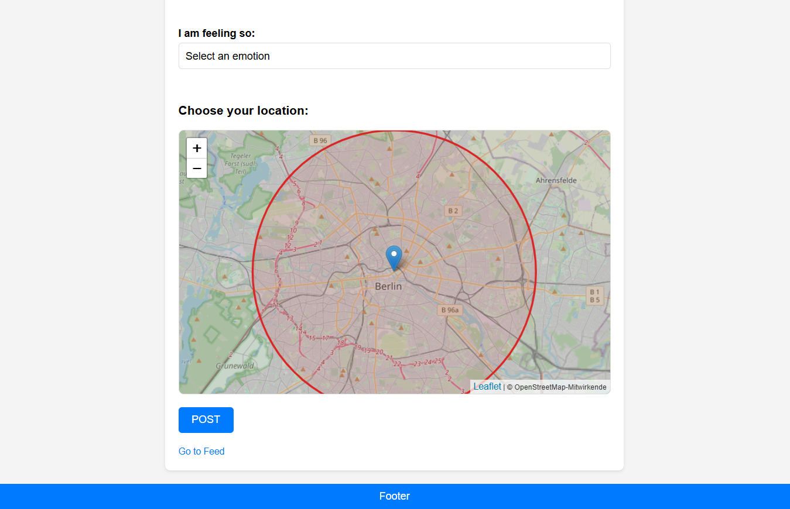
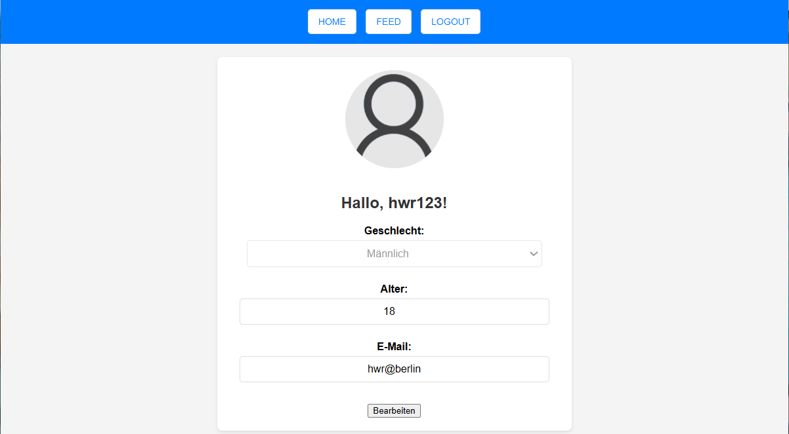

# UI components

Die Benutzeroberfläche (UI) der Webanwendung "Entdeckungsreise" wurde analysiert, um deren Gestaltung, Benutzerfreundlichkeit und Funktionalität zu bewerten.

{: .info }
> Die Startseite begrüßt den Benutzer mit einem ansprechenden Hintergrundbild. Die Navigation erfolgt über ein seitliches und oberes Menü.
> - Navigation: Die obere Leiste enthält Schaltflächen für "Login" und "Registrieren" mit gut erkennbaren Symbolen.
> - Willkommensbereich: Eine klare und prägnante Begrüßung mit einer kurzen Einführung in die Anwendung.
> - Seitenleiste (rechts): Zeigt aktuelle Wetterinformationen und bevorstehende Events.
> - Seitenleiste (links): Enthält eine Entdeckungsfunktion mit "Top Locations", "Geheime Orte" und "Empfohlene Touren".
> *Usability-Analyse:* Die Struktur ist intuitiv, die Navigationselemente sind leicht auffindbar und visuell ansprechend. Besonders durch den Einsatz von Icons (z.ß:🌍,🌟,🌅,usw.) könnte die Seite lebendiger und intuitiver wirken. Der Kontrast zwischen Text und Hintergrund verbessert die Lesbarkeit.

---

{: .info }
> Schlicht und auf den Punkt: Benutzername, Passwort, Login-Button – mehr braucht’s nicht. Falls man noch kein Konto hat, gibt’s direkt einen Link zur Registrierung. Die Farben und Buttons sind gut sichtbar, sodass man sich schnell einloggen kann.

---

{: .info }
> Die "Post Seite" ermöglicht es den Nutzern, ihre Reiseerlebnisse auf verschiedene Weise zu teilen. Sie können ein Bild hochladen, eine Beschreibung ihres Erlebnisses hinzufügen, eine Emotion aus einer Dropdown-Liste auswählen und ihren Standort auf einer Karte markieren. Obwohl einige Funktionen noch nicht vollständig ausgereift sind, können Nutzer bereits jetzt ihren Standort innerhalb dieses Bereichs festlegen.

---

{: .info }
> Die Karte selbst ist auf das Zentrum von Berlin beschränkt und wird durch einen roten Kreis eingegrenzt. Obwohl einige Funktionen noch nicht vollständig ausgereift sind, können Nutzer bereits jetzt ihren Standort innerhalb dieses Bereichs festlegen.

---

{: .info }
> Hier kann man seine Benutzerdaten sehen und bearbeiten. Alles ist mittig platziert und gut lesbar. Oben gibt’s eine einfache Navigation, um schnell zu anderen Seiten zu springen. Zu sehen ist Eingabefelder zur Bearbeitung von "Geschlecht", "Alter" und "E-Mail". Es gibt auch eine Schaltfläche "Bearbeiten", um Änderungen zu speichern.

