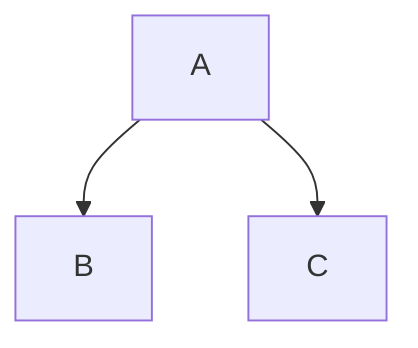

> ---
> title: UI Components
> nav_exclude: true
> ---
> ```

# UI components

Die Benutzeroberfläche (UI) der Webanwendung "Entdeckungsreise" wurde analysiert, um deren Gestaltung, Benutzerfreundlichkeit und Funktionalität zu bewerten.

## Images


{: .info }
> Die Startseite begrüßt den Benutzer mit einem ansprechenden Hintergrundbild. Die Navigation erfolgt über ein seitliches und oberes Menü.
> - Navigation: Die obere Leiste enthält Schaltflächen für "Login" und "Registrieren" mit gut erkennbaren Symbolen.
> - Willkommensbereich: Eine klare und prägnante Begrüßung mit einer kurzen Einführung in die Anwendung.
> - Seitenleiste (rechts): Zeigt aktuelle Wetterinformationen und bevorstehende Events.
> - Seitenleiste (links): Enthält eine Entdeckungsfunktion mit "Top Locations", "Geheime Orte" und "Empfohlene Touren".
> * Usability-Analyse:* Die Struktur ist intuitiv, die Navigationselemente sind leicht auffindbar und visuell ansprechend. Der Kontrast zwischen Text und Hintergrund verbessert die Lesbarkeit.

---


{: .info }
> Schlicht und auf den Punkt: Benutzername, Passwort, Login-Button – mehr braucht’s nicht. Falls man noch kein Konto hat, gibt’s direkt einen Link zur Registrierung. Die Farben und Buttons sind gut sichtbar, sodass man sich schnell einloggen kann.

---


{: .info }
> Schlicht und auf den Punkt: Benutzername, Passwort, Login-Button – mehr braucht’s nicht. Falls man noch kein Konto hat, gibt’s direkt einen Link zur Registrierung. Die Farben und Buttons sind gut sichtbar, sodass man sich schnell einloggen kann.


## Labels

{: .label }
[Default label]

{: .label .label-green }
[Green label]

{: .label .label-red }
[Red label]

## Mermaid.js



Visit the [Mermaid docs](https://mermaid.js.org/intro/) for a thorough description of the charting possibilities.